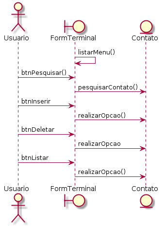
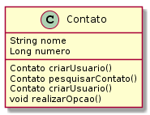

<div align="center">
      
</div>

<div align="center">
  <strong>Lista Telefônica By Terminal</strong>
</div>

## Start Project🏃‍

Ao iniciar o projeto, será listado um menu com 4 opções:
- **INSERIR —** Essa função é para adicionar um novo contato, os parâmetros são nome e números (separados por ";") .
-  **DELETAR —** Essa função é para remover um usuário do banco de dados através de seu número de telefone.
- **PESQUISAR —** Essa função é para pesquisar por nome ou número do contato, é necessário inserir no minimo uma letra para realizar a pesquisa. 
- **LISTAR —** Essa função é para listar todos os contatos existentes na lista telefônica do usuário. 
First, make sure you have installed [Sketch](http://sketchapp.com) version 50+, & a recent [npm](https://nodejs.org/en/download/).

Colaborar para a atividade:

```bash
git https://github.com/MarLubanco/exericios-labIII.git
cd exericios-labIII

npm run render
```

## Documentação
- **Caso de Uso —** 


- **Diagrama de Sequência —** 



- **Diagrama de Classe —** 



[](https://www.npmjs.com/package/react-sketchapp)  [](https://travis-ci.org/airbnb/react-sketchapp) [](https://gitter.im/react-sketchapp/Lobby)

## Documentation

- [Examples](http://airbnb.io/react-sketchapp/docs/examples.html)
- [API Reference](http://airbnb.io/react-sketchapp/docs/API.html)
- [Styling](http://airbnb.io/react-sketchapp/docs/styling.html)
- [Universal Rendering](http://airbnb.io/react-sketchapp/docs/guides/universal-rendering.html)
- [Data Fetching](http://airbnb.io/react-sketchapp/docs/guides/data-fetching.html)
- [FAQ](http://airbnb.io/react-sketchapp/docs/FAQ.html)
- [Contributing](http://airbnb.io/react-sketchapp/CONTRIBUTING.html)
