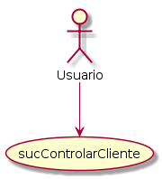
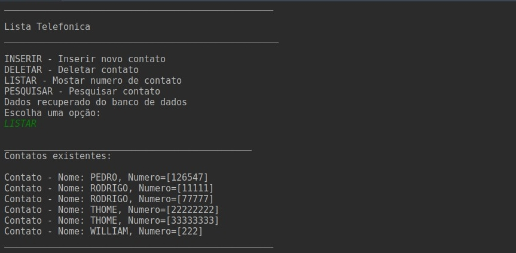
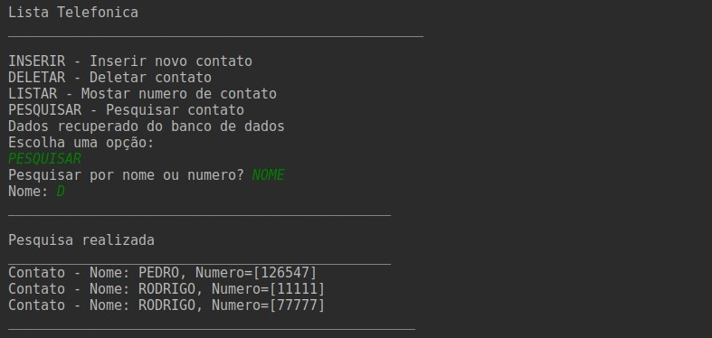

<div align="center">
      
</div>

<div align="center">
  <strong>Lista Telefônica By Terminal</strong>
</div>

## Start Project🏃‍

Ao iniciar o projeto, será listado um menu com 4 opções:

| |COMANDOS|  |  | |
|---|---|---|---|---|
INSERIR|Essa função é para adicionar um novo contato, os parâmetros são nome e números (separados por ";") . | | | | |
DELETAR|  Essa função é para remover um usuário do banco de dados através de seu número de telefone.||| | |
PESQUISAR | Essa função é para pesquisar por nome ou número do contato, é necessário inserir no minimo uma letra para realizar a pesquisa.  | | | | |
LISTAR |Essa função é para listar todos os contatos existentes na lista telefônica do usuário.  ||| | |


Colaborar para a atividade:

```bash
git https://github.com/MarLubanco/exericios-labIII.git
cd exericios-labIII

```

## Documentação
- **Caso de Uso —** 



- **Diagrama de Sequência —** 


- **Diagrama de Classe —** 


## Imagens do projeto

<div align="center">
      
</div>

<div align="center">
  <strong>Listagem dos contatos</strong>
</div>
<br>
<hr>

<div align="center">
      
</div>

<div align="center">
  <strong>Pesquisa por nome</strong>
</div>

